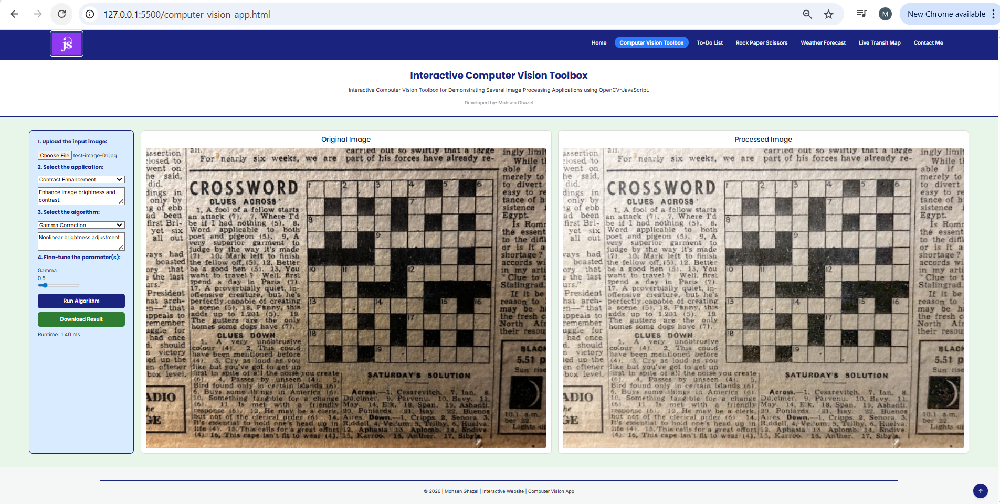
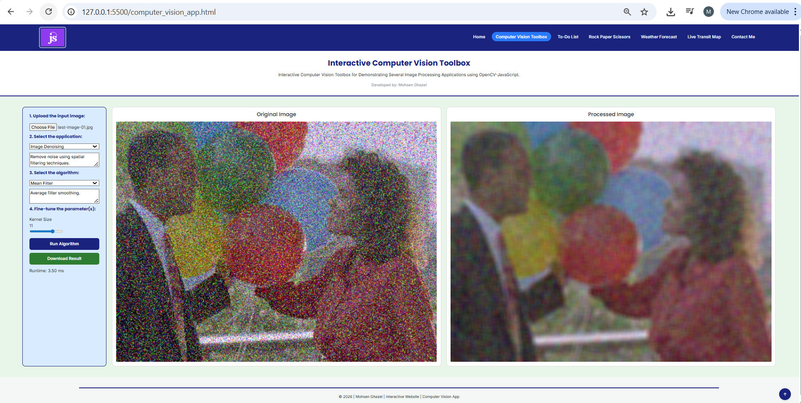
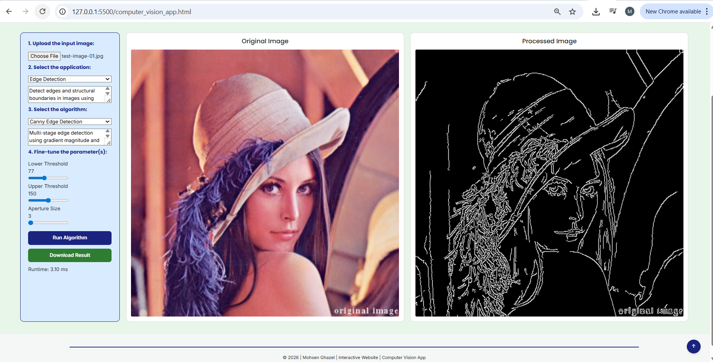
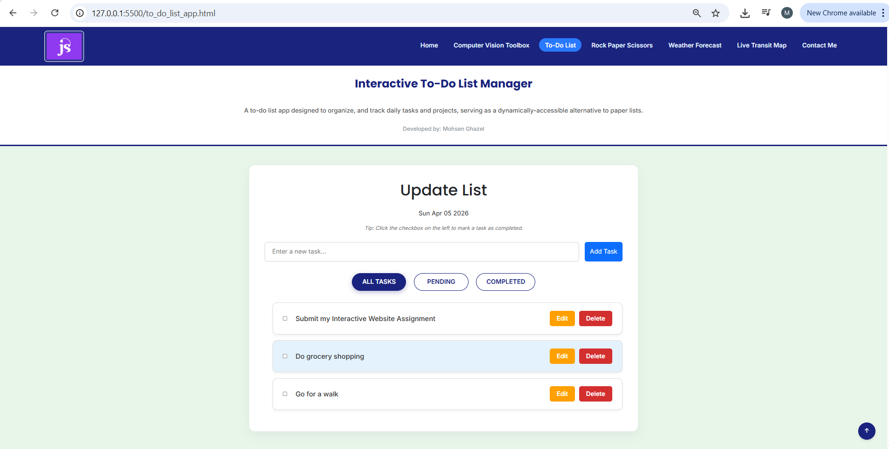
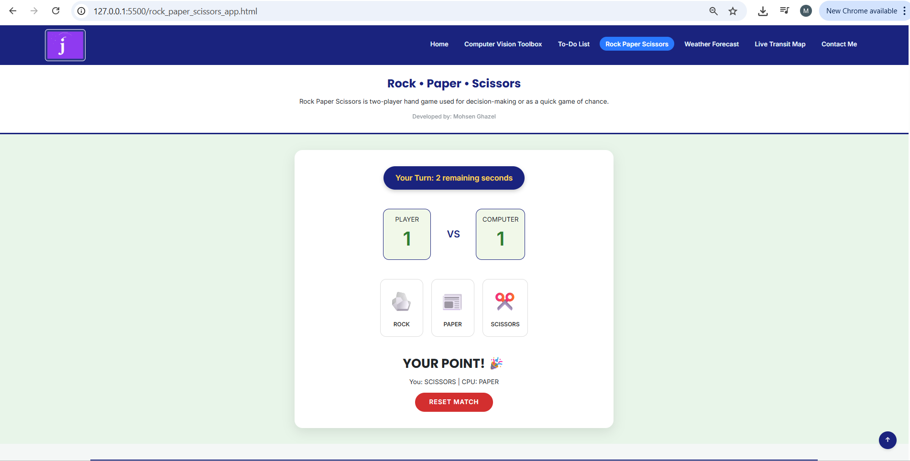
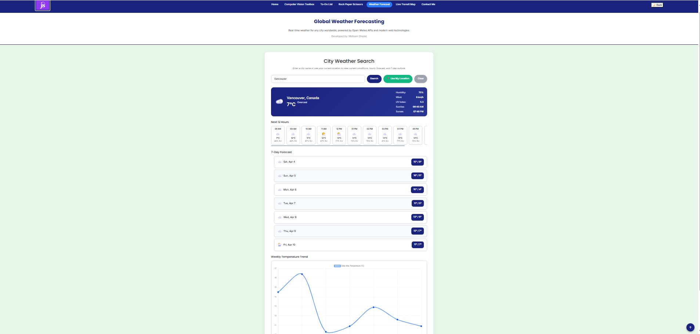
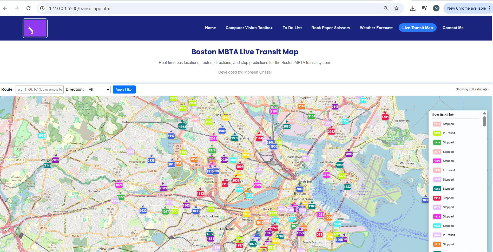
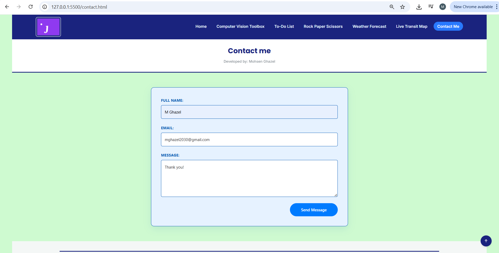

# 🌐 Multi‑App Interactive Website

A collection of interactive, browser‑based applications showcasing interactive:
- JavaScript programming
- Computer vision and image processing algorithms using OpenCV-JavaScript 
- Asynchronous JavaScript 
- JSON, AJAX and Fetch API  
- Real-time data visualization
- UI/UX design.  

Each app is fully self‑contained and accessible from the homepage.

---

# 🏷️ Badges


---

# 📚 Table of Contents

1. [Overview](#overview)  
2. [Included Applications](#included-applications)  
3. [Computer Vision App (Flagship)](#1-computer-vision-app-flagship-application)  
4. [To‑Do List App](#2-to-do-list-app)  
5. [Rock‑Paper‑Scissors Game](#3-rock-paper-scissors-game)  
6. [Weather Forecasting App](#4-weather-forecasting-app)  
7. [Transit App — MBTA Live Bus Tracker](#5-transit-app--mbta-live-bus-tracker)  
8. [Contact Form](#6-contact-form)  
9. [Technologies Used](#technologies-used)  
10. [Folder Structure](#folder-structure)  
11. [Running the Project](#running-the-project)  
12. [Future Enhancements](#future-enhancements)  
13. [Developer](#developer)

---

# 📌 Overview

This website contains **six fully developed applications** plus a contact page:
- The **Computer Vision App** is the flagship feature:
   - A deeply technical, interactive computer vision and image‑processing Toolbox
   - Built using the JavaScript computer vision OpenCV.js library.

---

# 📦 Developed Interactive Applications

1. **Computer Vision App (OpenCV.js)**  
2. **To‑Do List App**  
3. **Rock‑Paper‑Scissors Game**  
4. **Weather Forecasting App**  
5. **Transit App — MBTA Live Bus Tracker**  
6. **Contact Form**

---

# 🧠 1. Computer Vision App (Flagship Application)

An interactive, browser-based Computer Vision App for experimenting with **Image Processing**  using **OpenCV.js**.

This project provides a **hands-on visual learning environment** where users can:
1. Upload an input images
2. Select an image processing operation
3. Select one of the available algorithms for the selected image processing operation
4. Fine the parameter(s) of the selected algorithm in real-time
5. Observe the results of the selected image processing operation, algorithm and associated parameter(s), in near real-time.

---

## 🚀 Features

### 🔹 Image Processing Operations

#### 1. Contrast Enhancement

* Gamma Correction
* Linear Transformation (Brightness & Contrast)
* Global Histogram Equalization (GHE)
* CLAHE (Contrast Limited Adaptive Histogram Equalization)

#### 2. Image Denoising

* Mean Filter
* Median Filter
* Gaussian Filter
* Bilateral Filter

#### 3. Edge Detection

* Canny Edge Detector
* Sobel Operator
* Laplacian Operator

---

### ⚙️ Interactive Capabilities

* 📂 Upload grayscale or color images
* 🎚️ Dynamic parameter adjustment via sliders
* ⚡ Real-time algorithm execution (auto-run)
* 🖼️ Side-by-side comparison (Original vs Processed)
* 📐 Aspect ratio preservation (no distortion)
* ⏱️ Algorithm runtime measurement (ms)
* 💾 Download processed images
* 🎨 Clean, structured UI for experimentation

---

## 🧩 How It Works

### 1. Workflow

1. Upload an input **Image**:
	- As shown in the table below, we provide test-images for the 3 types of image processing operations
2. Select an **Image Processing Operation**:
3. Choose an **Algorithm**
4. Adjust **Parameters**
5. Click **Run** (or use auto-run)
6. View results instantly


| Image Processing Operation       | Test image file name                       |
| ---------------------------------| ------------------------------------------ |
| Enhancement                      | `assets/enhancement/test-image-01.jpg`       |
| Denoising                        | `assets/denoising/test-image-01.jpg`         |
| Edge Detection                   | `assets/edges/test-image-01.jpg`             |


---

### 2. Architecture Overview

| Component       | Responsibility                             |
| --------------- | ------------------------------------------ |
| `computer_vision_app.html`    | Home page                                  |
| `cv_styles.css`    | CSS style file                             |
| `cv_data.js`       | Defines operations, algorithms, parameters |
| `cv_ui.js`         | Builds dynamic UI elements                 |
| `cv_algorithms.js` | Implements OpenCV functions                |
| `cv_app.js`        | Controls execution flow                    |

---

## 🔬 Algorithm Highlights

### Gamma Correction

```
Output = Input^γ
```

* Nonlinear brightness transformation
* Useful for illumination correction

---

### Linear Transformation

```
Output = α * Input + β
```

* α → contrast
* β → brightness

---

### CLAHE

* Adaptive histogram equalization
* Prevents over-amplification of noise
* Works locally on image tiles

---

### Bilateral Filter

* Edge-preserving smoothing
* Combines spatial + intensity filtering

---

### Canny Edge Detector

Multi-stage pipeline:

1. Gaussian smoothing
2. Gradient computation
3. Non-maximum suppression
4. Hysteresis thresholding

---


## 📐 Sample Results

Sample output of applying _image enhancement, image denoising and edge-detection_ image processing algorithms are illustrated in the following figures.

<figure style="text-align: center;">
    
    <figcaption>Sample image enhancement output via Gamma correction algorithm (gamma = 0.5).</figcaption>
</figure>

<figure style="text-align: center;">
    
    <figcaption>Sample image denoising output via Median Filter algorithm. (kernel size = 11).</figcaption>
</figure>

<figure style="text-align: center;">
    
    <figcaption>Sample edge detection output via Canny algorithm. (lower-threshold = 77, upper-threshold = 150, aperture-size = 3).</figcaption>
</figure>


## 📐 Design Considerations

* ✔ Aspect ratio preserved for all images
* ✔ Output always converted to RGBA for canvas rendering
* ✔ Odd kernel sizes enforced where required
* ✔ Memory managed via `Mat.delete()` to avoid leaks

---

## 🎨 UI Design

* Light-blue unified interface (sidebar + canvas)
* Thin borders for clear separation
* Centered runtime display
* Responsive layout
* Clean, educational-focused design

---

## ⚠️ Known Limitations

* Large images may impact performance
* OpenCV.js runs on CPU (no GPU acceleration)
* No batch processing (single image at a time)

---

## 🔮 Future Improvements

Planned enhancements:

* 📊 Histogram visualization (RGB + grayscale)
* 🧠 Image segmentation algorithms
* 📦 Multi-image processing (registration, stitching, etc.) 

---

## 🙏 Resources

* [OpenCV.js](https://docs.opencv.org/4.x/d5/d10/tutorial_js_root.html)
* [Image processing using OpenCV.js](https://docs.opencv.org/4.x/d2/df0/tutorial_js_table_of_contents_imgproc.html)
* [JavaScript resources](https://developer.mozilla.org/en-US/docs/Web/JavaScript)

---

# 📝 2. To‑Do List App

A clean, interactive task‑management tool with built‑in validation and filtering.

### ✔ Features

- Create a new task (only if it does **not** already exist)  
- Duplicate tasks are **not allowed**  
- Mark tasks as completed  
- Delete completed tasks  
- Display:
  - All tasks  
  - Pending tasks  
  - Completed tasks.  


### 📐 Sample Results

Sample output of the _To-Do List_ app is illustrated in the following figure.

<figure style="text-align: center;">
    
    <figcaption>Sample To-Do List App Screen. </figcaption>
</figure>

---

# ✊ 3. Rock‑Paper‑Scissors Game

A dynamic, time‑pressured version of the classic Rock‑Paper‑Scissors hand game.

### 🎮 Features

- Player vs Computer:  
  - Each round results in:
     - Player Wins  
     - Computer Wins  
     - Tie.  
- **5‑second countdown timer** per turn:  
  - If the player does not choose in time → computer scores a point  
- **Best of 15 match**  
  - First to 8 points wins  
- Option to start a new match.  

### 📐 Sample Results

Sample output of the _Rock-Paper-Scissors_ app is illustrated in the following figure.

<figure style="text-align: center;">
    
    <figcaption>Sample Rock-Paper-Scissors App Screen.</figcaption>
</figure>

---

# 🌦️ 4. Weather Forecasting App

A visually rich, API‑powered 7‑day weather dashboard using the [**Open-Meteo Forecast API**](https://open-meteo.com/)

- The Open-Meteo Forecast API provides free, open-source, location-based weather data without requiring an API key. 
- It enables retrieval of current conditions, hourly forecasts, and 10-day daily forecasts via HTTP GET requests for any latitude and longitude, supporting up to 600 calls per minute.


### 🌍 Features

- Search any major international city  
- Display 7‑day forecast including:
  - Temperature  
  - Humidity  
  - Wind  
  - UV Index  
  - Sunrise  
  - Sunset  
  - Weather condition icons  
- Temperature fluctuation graph  
- “Use My Location” (geolocation API)  
- Search, Use‑My‑Location, and Clear buttons  

### 📐 Sample Results

Sample output of the _Weather_ app is illustrated in the following figure.

<figure style="text-align: center;">
    
    <figcaption>Sample Weather App Screen.</figcaption>
</figure>

---

# 🚌 5. Transit App — MBTA Live Bus Tracker

A real‑time transit visualization tool using the [**Massachusetts Bay Transportation Authority (MBTA) - Boston Vehicles API**](https://api-v3.mbta.com/):

- MBTA (Boston) was selected because:
   - Fully open
   - Works directly in browser
   - No API key required
   - Real‑time vehicle positions.

### 🚏 Features

- Live bus locations updated continuously  
- Route filter + direction filter  
- Custom colored bus icons with direction arrows  
- Smooth animated bus movement  
- Sidebar with live bus list (click to zoom)  
- Bus stops + arrival predictions for selected route  
- Uses MBTA’s open API (no registration or API key required)  

### 📐 Sample Results

Sample output of the _MBTA Transit_ app is illustrated in the following figure.

<figure style="text-align: center;">
    
    <figcaption>Sample MBTA Transit App Screen.</figcaption>
</figure>

---

# ✉️ 6. Contact Form

A simple, clean form allowing users to send messages or inquiries via email.

### 📐 Sample Output

Sample output of the _Contac_t form is illustrated in the following figure.

<figure style="text-align: center;">
    
    <figcaption>Sample Contact Form Screen.</figcaption>
</figure>

---

# 🛠️ Technologies Used

- **HTML5**  
- **CSS3**  
- **JavaScript (ES6+)**  
- **Bootstrap**  
- **Google Fonts**  
- **OpenCV.js**  
- **REST APIs** (Weather API, MBTA API)  

---

# 📁 Folder Structure

```
project-root/
│
├── assets/
│   ├── images/
|   |   ├── enhancement/
|   |	|   ├──test-image-01.jpg
|   |	|
|   |	├── denoising/
|   |	|   ├──test-image-01.jpg
|   |	|
|   |	└── edge_detection/
|   |	    ├──test-image-01.jpg
|   |
|   |
│   └── icons/
	 ├──js-animation.gif
│
├── css/
│   └── styles.css
|
│
├── js/
│   ├── cv_app.js
│   ├── cv_algorithm.js
│   ├── cv_scripts.js
│   ├── cv_ui.js
│   ├── tdl_script.js
│   ├── rps_script.js
│   ├── weather_script.js
│   └── transit_script.js
│
├── index.html
├── computer_vision_app.html
├── to_do_list_app.html
├── rock_paper_scissors_app.html
├── weather_app.html
├── transit_app.html
├── contact.html
|
|
└── README.md
```

# ▶️ Running the Project

1. Clone the repository  
2. Open the project folder  
3. Launch `index.html` in any modern browser  

---

# 🔮 Future Enhancements

- Additional computer vision and image processing operations  
- User preferences and settings  

---

# 📄 License

This project is open-source and available under the MIT License.

---

## 📄 Developer

**Mohsen Ghazel**

---